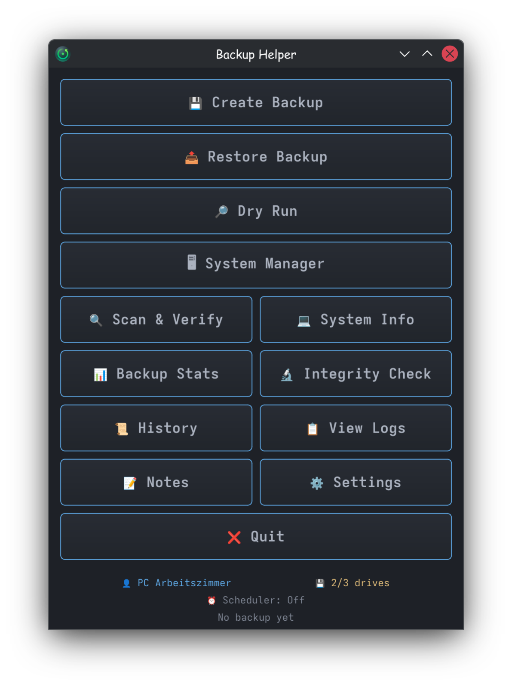
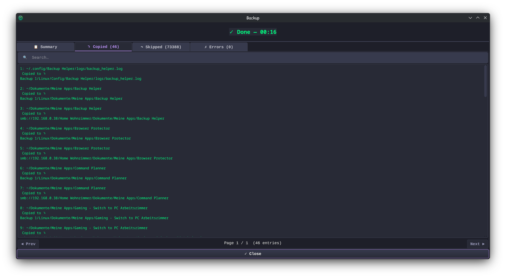
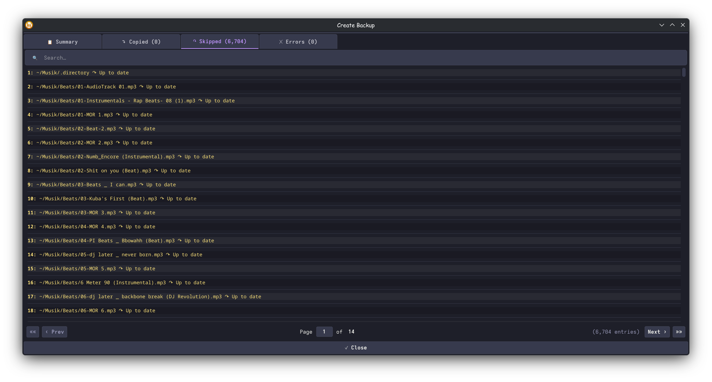
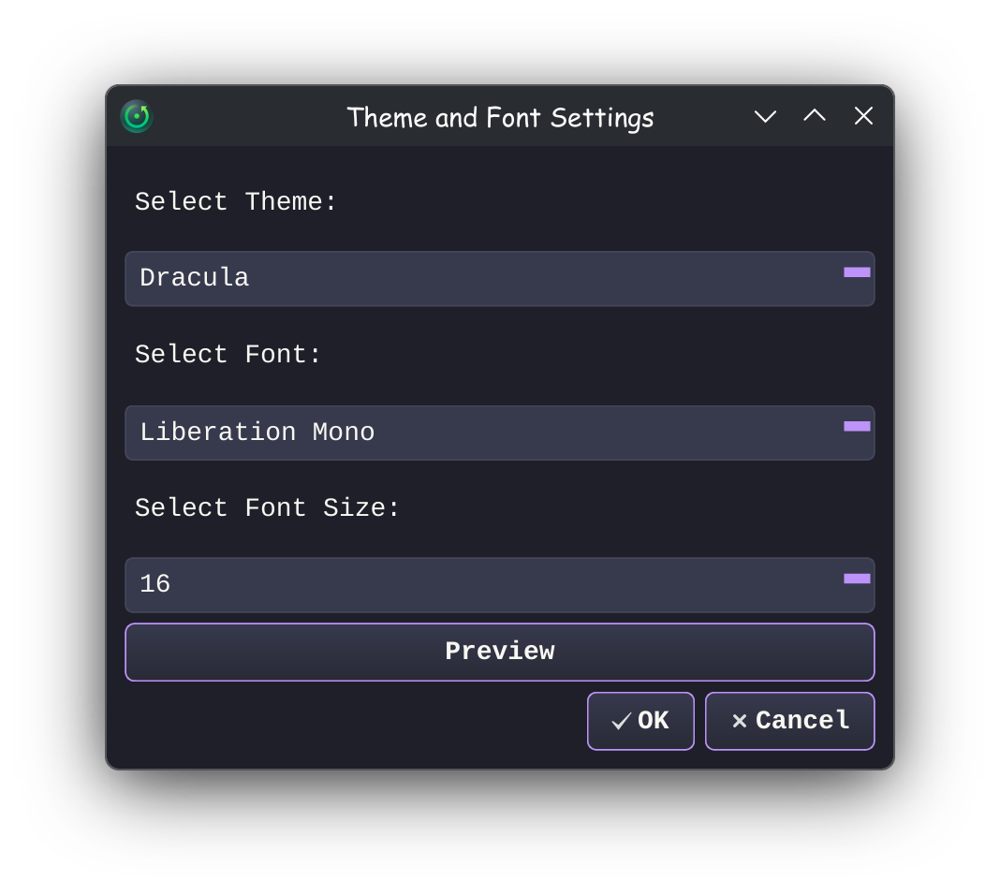

# Linux-Backup-Helper

**Linux-Backup-Helper** is a graphical Python tool for backups and system management under Linux.  
The idea behind this project is to automatically configure a newly installed Linux system — packages, services, system files, and all the configuration you need, with a single click.

> Since this is my first project and I'm still new to programming, I'd really appreciate any feedback or suggestions. I'm still learning, so please don't expect everything to be perfect. But at least on my system, it runs very quickly and smoothly. Of course, this app was created with the help of AI, mainly using Claude.

---

## Features

- Backup and restore with a modern GUI (PyQt6)
- Supports all major Linux distributions
- Mount and unmount drives with graphical dialogs
- Package management (pacman/yay and others) with full system operations
- Samba/SMB share support with secure credential storage
- Advanced configuration options and multi-session support
- Customizable headers and layouts for different backup types
- **System Capture & Verify** — scan your system and compare it against your profile
- **Dry Run** — preview backup or restore operations (new/updated/skipped files) before anything is actually copied
- **Integrity Checker** — verify backup integrity via hashing
- **Disk Analyzer** — scan disk usage and identify space usage
- **Dotfiles Manager** — deploy and back up dotfiles with diff view before overwriting
- **Scheduler** — automate backups via systemd timers, with configurable interval and AC-power-only option
- **Pre/Post Hooks** — run custom scripts before and after backup steps
- **Profile Compare** — compare two backup profiles against each other
- **Backup History** — browse past backup runs, with CSV/JSON export
- **Backup Stats** — visual statistics dashboard for backup activity
- **Quick Backup** — one-click backup of individual headers from the system tray menu
- System tray integration for background operation
- Theming support with multiple built-in themes
- Extensive error handling and user feedback

---

## How Files are Copied and When They are Skipped

**Copied files:**
- Files are copied if the source file is newer than the destination, or if the destination does not exist.
- For directories, all contained files are evaluated individually.
- File attributes (modification time, permissions) are preserved.
- Network (SMB) paths are supported; files can be copied to and from SMB shares.

**Skipped files** — a file is skipped and NOT copied if:
- The destination file already exists **and** has the same size **and** is at least as new as the source (i.e., already up to date).
- The file matches certain protection/lock patterns (e.g. `Singleton`, `lockfile`, `cookies.sqlite-wal`, …).
- The source file does not exist or cannot be accessed.

Skipped files are shown in the **Skipped** tab with the reason *"Up to date"*.

**Errors:**  
If an error occurs during copying (permission denied, network issues, etc.) the file is not copied and the error is shown in the **Errors** tab.

**Summary:**  
The summary shows the total number of processed, copied, skipped, and error files.  
The tooltip colour-codes the results: green = copied, yellow = skipped, red = errors.

---

## System Capture & Verify

The **System Capture & Verify** dialog (accessible from the main menu via **🔍 Capture & Verify**) consists of two tabs.

### 🔍 System Capture

Scans your currently installed system and compares the result against your active profile.

**Packages:**
- Detects all installed packages (basic and AUR on Arch, manually installed on other distros).
- Packages already tracked in the profile are shown as "already in profile" and excluded from the selection.
- System-critical packages (kernel, base, firmware, microcode) and packages managed by System Manager (e.g. yay, samba, openssh, bluetooth) are automatically excluded.
- New packages can be selected individually or all at once with **Select All New**, then added to the profile with **⬆ Add Selected to Profile**.

**Specific Packages:**
- Packages that should only be installed for a specific desktop session (e.g. KDE-only or Hyprland-only packages) can be marked as **Specific Packages**.
- Select the target session from the dropdown, tick the packages, and click **⬆ Add Selected as Specific**.
- Adding a package as Specific automatically removes it from Basic Packages if it was listed there.

**Services:**
- Active system services (SSH, Samba, Bluetooth, Firewall, CUPS, Cron, Snapd, atd) are listed with their current status.
- Services already configured in System Manager Operations are shown greyed out.
- Tick any service you want System Manager to manage, then click **⬆ Add Selected Services to Profile**.

### ✅ Verify Profile

Runs a full check of your active profile against the current system state.

| Check | What is verified |
|---|---|
| **Packages** | Every package in the profile (basic, AUR, specific) is checked for installation |
| **System Files** | Source and destination of every system file entry are compared (hash for files ≤ 8 MB, mtime otherwise) |
| **Backup Entries** | Source and destination paths are checked for existence; outdated backups are flagged |
| **Services** | All services referenced in System Manager Operations are checked for active status |

Results are grouped in collapsible sections with colour-coded status icons. A summary banner at the top shows the overall result at a glance.  
Required drives that are not yet mounted are automatically detected and the user is prompted to mount them before the check runs.

**Re-run Check** reruns the verification at any time without reopening the dialog.

---

## System Manager

### Usage

1. Optionally select **System Files** — these are copied using `sudo` for root privileges (e.g. `pacman.conf`, `smb.conf` → `/etc/`).
2. Under **System Manager Operations**, choose which actions to execute. Actions run sequentially; uncheck any you want to skip.

### Package types

| Type | Description |
|---|---|
| **Basic Packages** | Installed with the default package manager of your distribution |
| **AUR Packages** | Installed from the Arch User Repository via **yay** (yay is installed automatically if missing) |
| **Specific Packages** | Installed with the default package manager, but only when the corresponding session is detected (supports full desktop environments and window managers such as Hyprland) |

---

## Dry Run

The **🔎 Dry Run** dialog previews a backup or restore operation without copying, deleting, or modifying anything.

- Choose between **Backup Preview** (source → destination) and **Restore Preview** (destination → source) mode from the mode selector.
- Results are grouped per entry, showing files that would be **new**, **updated**, or **skipped**, with a global overview across all entries.
- Switch between backup and restore preview at any time from within the dialog without closing it.
- Useful for verifying what a run would do before committing to it, especially after changing entries or excludes.

---

## Integrity Checker

The **Integrity Checker** verifies that files in your backup destination match their source using hashing, helping catch silent corruption or incomplete copies that size/mtime comparisons alone might miss.

---

## Disk Analyzer

The **Disk Analyzer** scans a directory tree and reports disk space usage, helping identify what is consuming space before or after a backup.

---

## Dotfiles Manager

The **Dotfiles Manager** deploys tracked dotfiles from your backup into place (or backs up existing ones into your profile).

- Shows a diff before overwriting any existing file, so changes are never applied blindly.
- Supports deploying selected files individually or all at once.

---

## Scheduler

The **Scheduler** automates backups using **systemd timers** — no cron setup required.

- Choose a backup interval and, optionally, restrict runs to when the system is on AC power (useful for laptops).
- The timer can be installed, removed, or checked for its next scheduled run time directly from the dialog.

---

## Pre/Post Hooks

Custom shell commands can be configured to run **before** and/or **after** a backup:

- Hooks run sequentially in the order listed and can be reordered.
- If a "before" hook fails, the backup is aborted by default (configurable).

---

## Profile Compare

The **Profile Compare** dialog compares two backup profiles side by side — packages, system files, backup entries, and services — highlighting what differs between them. Useful when maintaining multiple machine profiles or checking drift after manual changes.

---

## Backup History & Stats

- **History** — every backup run is logged and browsable afterward, with the ability to export the log as CSV or JSON.
- **Backup Stats** — a visual dashboard summarising backup activity over time (files copied, skipped, errors, run durations).

---

## Samba / SMB Support

Linux-Backup-Helper can copy files to and from Samba network shares. Source and/or destination paths must follow this pattern:

```
smb://ip/rest-of-path
```

**Example:**
```
smb://192.168.0.53/share/mydata
```

### Requirements for SMB support

**On your local machine** (`smbclient` is needed to communicate with the share):

- `smbclient` must be installed locally. The `install.sh` script will ask you whether to install it.
- On Arch-based systems, installing the `samba` package automatically includes `smbclient`.
- On Debian/Ubuntu: `sudo apt install smbclient`
- On Fedora: `sudo dnf install samba-client`
- On openSUSE: `sudo zypper install samba-client`

**On the remote machine** (the system hosting the share):

- Samba must be **installed and correctly configured** on the target system.
- The share must be accessible and the firewall must allow SMB traffic (port 445).
- Without a properly configured Samba server on the remote side, all SMB operations will fail with a connection error.

### Credentials & Security

- Credentials are **never stored in plain text**.
- They are stored securely via **KWallet** (KDE) or your **system keyring**.
- If KWallet is available and already contains an entry starting with `smb-`, that entry is used automatically.
- Otherwise, credentials can be managed directly in the application under **Samba Credentials**.
- The SMB password is written to a temporary credential file in `/dev/shm` (permissions 0600) and passed to smbclient via the `-A` flag.  
  The file is securely overwritten with zeros and deleted immediately after use.

### Connection order

1. Login with stored credentials is attempted first.
2. If that fails or no credentials are stored, a **guest/anonymous** connection is tried.
3. If that also fails, all SMB tasks are marked as errors with a corresponding note.

---

## Installation

### Quick install (recommended)

```bash
git clone https://github.com/TomKo1987/Linux-Backup-Helper.git
cd Linux-Backup-Helper
chmod +x install.sh
./install.sh
```

The script installs `inxi` and all Python dependencies automatically. It will also ask whether you want to install `smbclient` for SMB/Samba share support.

### Install as a package (pip)

This method installs the app as a proper Python package and registers the `backup-helper` command system-wide.

```bash
git clone https://github.com/TomKo1987/Linux-Backup-Helper.git
cd Linux-Backup-Helper
pip install --user .
```

After installation, the app can be launched from anywhere:

```bash
backup-helper
```

To uninstall:

```bash
pip uninstall linux-backup-helper
```

> **Note:** `inxi` and optionally `smbclient` still need to be installed separately via your system package manager (see Quick install above or the Requirements section).

### Manual install

```bash
git clone https://github.com/TomKo1987/Linux-Backup-Helper.git
cd Linux-Backup-Helper

python3 -m venv venv
source venv/bin/activate

pip install -r requirements.txt

python3 main.py
```

### Optional: standalone binary with PyInstaller

```bash
pip install pyinstaller
pyinstaller --onefile main.py
```

---

## Requirements

- **OS:** Linux (tested on Arch Linux; should work on most distributions)
- **Python:** 3.10+
- **Python packages:** PyQt6, keyring, secretstorage
- **System packages:** `inxi` (required), `smbclient` (optional — only needed for SMB/Samba share support)

---

## Screenshots

**Main Window**  


**Scan & Verify**  


**Backup Window**  


**Entry Manager**  


**Copy Worker**  


**Copied Files**  


**Skipped Files**  


**System Manager Launcher**  


**System Manager**  


**Basic Packages**  


**Themes**  


**Dry Run**  


**Integrity Check**  


---

## License

This project is licensed under the MIT License. See the [LICENSE](LICENSE.txt) file for details.

---

## Contributing

Contributions, bug reports, and feature requests are very welcome!  
Please open an issue or a pull request.

---

## Disclaimer

This software is provided "as is", without warranty of any kind.  
Always test your backup and restore operations carefully before relying on them.
