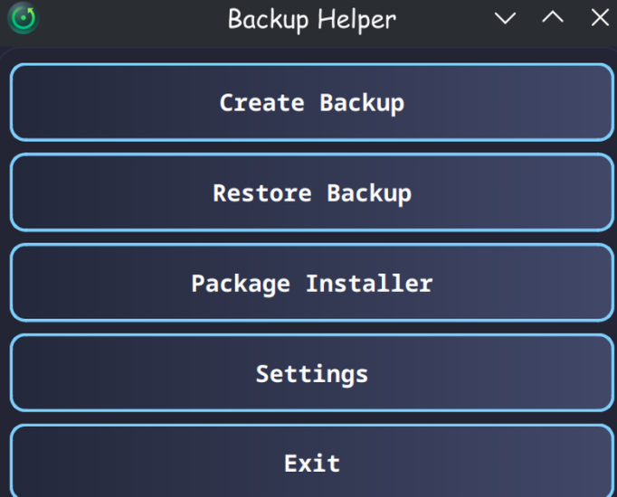

# Backup Helper

Backup Helper is a graphical Python tool for backups and system management under Linux. The idea behind this project is to automatically configure a newly installed Linux system. Many services and all the packages you need are installed with the click of a button.

As this is my first project and I am new to programming, I would be very grateful for feedback and suggestions. I'm still learning and please don't expect everything to be perfect. But at least on my system it runs very fast and smoothly.

## Features

- Backup and restore with a modern GUI (PyQt6)
- Supports all major Linux distributions
- Mount and unmount drives with graphical dialogs
- Package management (pacman/yay and others) with system operations
- Samba share support with secure credential storage
- Advanced configuration options and multi-session support
- Customizable headers and layouts for different backup types
- Extensive error handling and user feedback

## Package Installer Usage and Tips

First you can select **System Files** in Package Installer. These files will be copied using `sudo`, for root privilege. If you have System Files selected, Package Installer will copy these first.

Under **Installer Operations** you can specify how you would like to proceed. Each action is executed one after the other. Uncheck actions to disable them.

### Tips

- It is possible to copy to and from samba shares. Source and/or destination must be saved as follows:

    ```
    smb://ip/rest of path
    ```

    **Example:**  
    ```
    smb://192.168.0.53/rest of smb share path
    ```

- **Essential Packages** will be installed using the default package manager of your distribution.
- **Additional Packages** provides access to the Arch User Repository. Therefore **yay** must and will be installed.
- You can also define **Specific Packages**. These packages will be installed (using the default package manager of your distribution) only if the corresponding session has been recognized. Both full desktop environments and window managers such as “Hyprland” and others are supported.


## Installation

1. **Clone the repository:**
    ```sh    
    git clone https://github.com/TomKo1987/Linux-Backup-Helper.git
    cd Linux-Backup-Helper
    ```

2. **Create a virtual environment and install dependencies:**
    ```sh
    python3 -m venv venv
    source venv/bin/activate
    pip install -r requirements.txt
    ```

3. **Run the app:**
    ```sh
    python -m main
    ```

4. **(Optional) Install as a CLI command:**
    ```sh
    pip install -e .
    main
    ```

5. **(Optional) Build a standalone binary with PyInstaller:**
    ```sh
    pyinstaller --onefile main.py
    ```

## Requirements

- Linux (tested on Arch Linux, should work on most distributions)
- Python 3.9+
- PyQt6, keyring, psutil

## Usage

- Use the GUI to create, restore, and manage backups.
- Manage system packages and perform system maintenance operations.
- Easily configure Samba network drives and credentials.
- Mount and unmount external drives as part of your backup workflow.

## License

This project is licensed under the MIT License. See the [LICENSE](LICENSE.txt) file for details.

## Contributing

Contributions, bug reports, and feature requests are welcome! Please open an issue or a pull request.

## Disclaimer

This software is provided "as is", without warranty of any kind. Always test your backup and restore operations carefully.


---

## Screenshots




